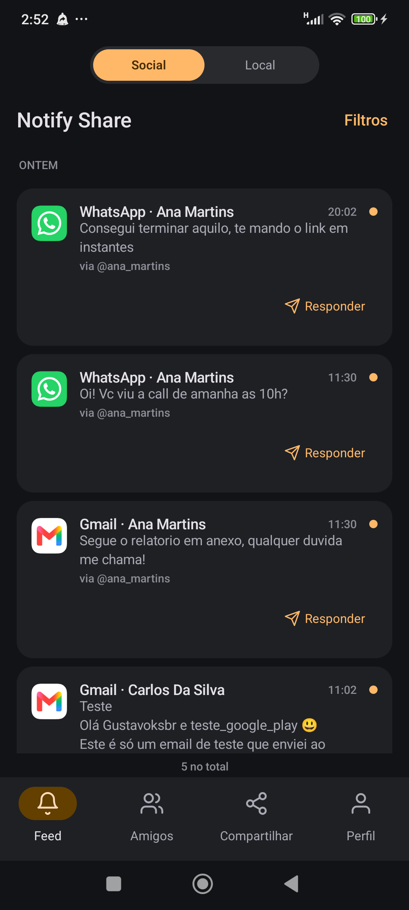
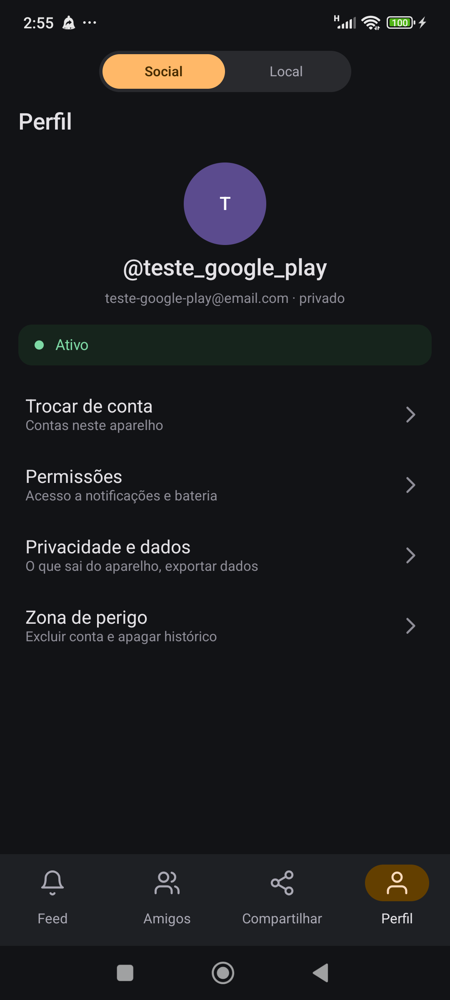
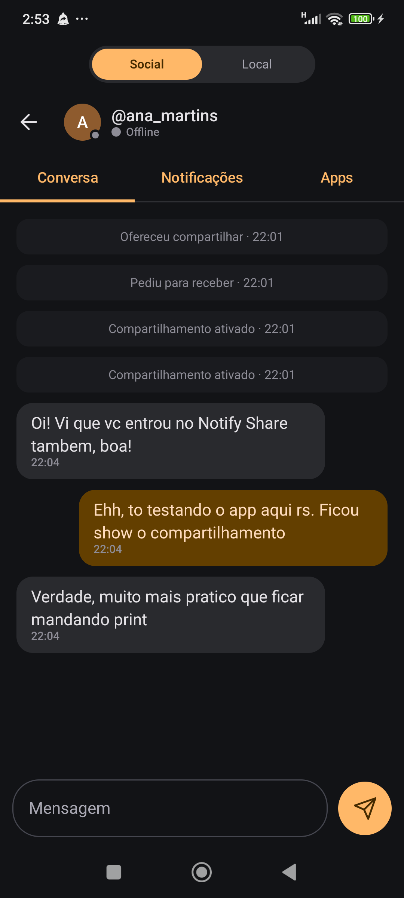
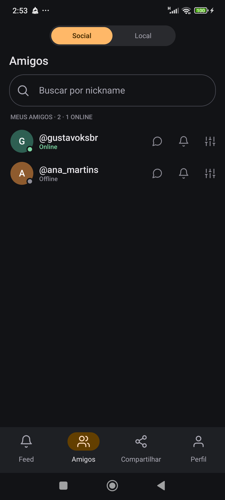
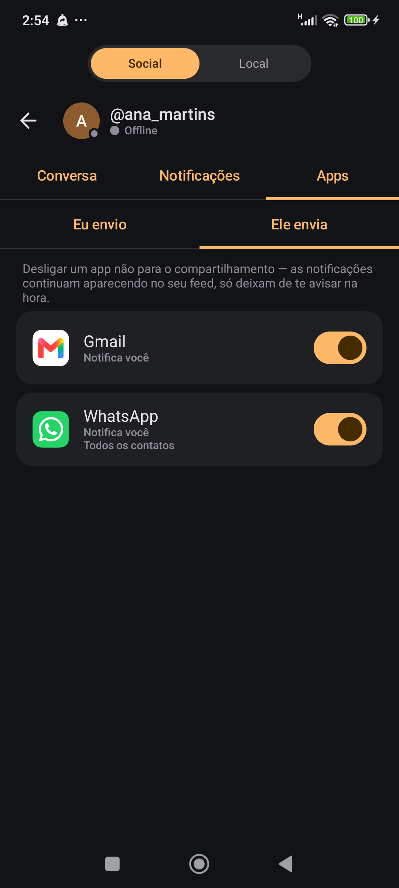

# Notify Share


https://github.com/Gustavoksbr/notify-share

Compartilhe as notificações do seu Android com pessoas que você escolher — e só
o que você escolher.

---

## Descrição

Notify Share é um app Android (com backend próprio) para compartilhar
notificações do seu celular com pessoas específicas, escolhendo exatamente o
quê: app por app, remetente por remetente, conteúdo completo ou só o aviso de
"chegou algo".

- **Social** — você adiciona amigos e libera um "grant" de compartilhamento
  para cada um, com regras independentes por pessoa. Quem recebe vê as
  notificações num feed e pode conversar com quem compartilhou, numa aba de
  chat própria.
- **Cofre local** — um modo "Local", desligado de conta/login, que guarda
  notificações escolhidas só neste aparelho, sem passar pelo servidor. Tem
  filtros (inclusive por período exato, com calendário) e exportação.
- **Regras finas** — por app dá para escolher entre mandar o conteúdo ou só
  avisar que chegou algo, e (em apps que suportam, como WhatsApp/Telegram)
  filtrar por remetente. Códigos de verificação (OTP) são bloqueados por
  padrão.
- **Entrega em tempo real** — a captura roda local via
  `NotificationListenerService`; a entrega ao destinatário vai por FCM (push)
  com um WebSocket como atalho enquanto o app está aberto.

---

## Capturas de tela

<p align="center">
  
  
  
  
  
</p>

---

## Como funciona

```
   APARELHO DE ORIGEM                    SERVIDOR             APARELHO DE DESTINO

  NotificationListener ─► Regras (local) ─► HTTPS ─► roteia ─► FCM ─► notificação local
                       └─► Cofre local (offline, sem servidor)          + histórico
```

Três decisões moldam tudo:

**As regras rodam no aparelho de origem.** O parsing da notificação e o filtro
"José sim, Maria não" acontecem antes de qualquer coisa sair do celular. O
servidor nunca precisa ler o conteúdo para fazer o trabalho dele — ele roteia.

**O filtro por remetente é genérico.** WhatsApp, Telegram, Signal, Messenger e
Discord usam `Notification.MessagingStyle`, que carrega um objeto `Person` por
mensagem. Não existe engenharia reversa por aplicativo: qualquer app que
notifique funciona, e o filtro por pessoa funciona onde o app usa o padrão de
mensagem.

**O FCM é o transporte oficial.** WebSocket não sobrevive ao Doze — o sistema
suspende a rede do processo quando a tela apaga. O WebSocket existe só como
atalho enquanto o app está em primeiro plano; toda entrega passa pelo FCM.

---

## Rodando o backend

Precisa de Java 21 e um Postgres local.

```bash
createdb notifyshare          # ou: psql -U postgres -c "create database notifyshare"
cd backend
./gradlew bootRun
```

Sobe em `http://localhost:8080`. O Flyway cria o schema sozinho na primeira
execução.

A documentação interativa fica em **http://localhost:8080/swagger** — dá para
exercitar a API inteira por ali, inclusive as rotas autenticadas (o botão
*Authorize* no topo aceita o `accessToken`). Em produção, `SWAGGER_ENABLED=false`
tira a UI e o `/v3/api-docs` do ar.

Configuração vem de variáveis de ambiente, com defaults de desenvolvimento em
`application.yml` — as chaves estão documentadas em `backend/.env.example`.
Em produção, `JWT_SECRET` é obrigatório e precisa de pelo menos 32 bytes.

### Endpoints

| Método | Rota | Autenticado | O quê |
|--------|------|-------------|-------|
| POST | `/auth/register` | não | Cria conta e já devolve os tokens |
| POST | `/auth/login` | não | Aceita nickname **ou** e-mail em `identifier` |
| POST | `/auth/refresh` | não | Rotaciona o refresh token |
| POST | `/auth/logout` | não | Revoga um refresh token |
| POST | `/auth/logout-all` | sim | Encerra todas as sessões |
| GET | `/me` | sim | Perfil do próprio usuário |
| PUT/DELETE | `/devices` | sim | Registra/remove o token do FCM deste aparelho |
| POST | `/devices/heartbeat` | sim | Sinal de vida (presença) |
| GET | `/users/search?q=` | sim | Busca pessoas por nickname |
| GET | `/users/{nickname}/profile` | sim | Perfil público de alguém (amizade, bloqueio, grants em comum) |
| POST | `/auth/google` | não | Login/registro com token do Google (ID token) |
| GET/POST | `/friends`, `/friends/requests` | sim | Amigos e pedidos de amizade |
| DELETE | `/friends/{nickname}` | sim | Desfaz a amizade |
| GET/POST | `/blocks` | sim | Lista e bloqueia usuários |
| DELETE | `/blocks/{nickname}` | sim | Desbloqueia |
| GET/POST | `/grants`, `/grants/pending`, `/grants/offers`, `/grants/requests` | sim | Compartilhamentos e caixa de pedidos |
| POST/DELETE | `/grants/{id}/accept\|decline\|pause\|resume` , `DELETE /grants/{id}` | sim | Ciclo de vida do grant |
| GET/PUT | `/grants/{id}/rules` | sim | Regras por app (só o sharer edita) |
| GET/PUT | `/grants/{id}/notify-rules` | sim | Preferências de aviso do destinatário (só quem recebe edita) |
| GET | `/me/export` | sim | Exporta os próprios dados (LGPD) |
| DELETE | `/me` | sim | Apaga a própria conta |
| POST | `/events` | sim | Ingestão de evento do aparelho de origem (idempotente por `dedupKey`) |
| GET | `/events`, `/events/conversation` | sim | Feed do destinatário, com filtros app/tipo/remetente/período |
| POST | `/events/deliveries/{id}/read` | sim | Marca notificação como lida |
| GET/POST | `/conversations/{nickname}` , `.../messages` , `.../read` | sim | Timeline (mensagens + auditoria de grant) |
| GET | `/presence?users=` | sim | Quem está online agora |
| WS | `/ws` (header `Authorization: Bearer <token>`) | handshake | Atalho de primeiro plano (evento/mensagem/typing/presença) |

A documentação completa e navegável continua no **Swagger** (`/swagger`).

Erros saem sempre no mesmo formato, e o cliente decide pelo `code`, nunca pela
mensagem:

```json
{ "code": "nickname_taken", "message": "Esse nickname ja esta em uso", "field": "nickname" }
```

---

## Estrutura

```
app/
├── backend/    Kotlin + Spring Boot 4 + Postgres + Flyway
│   └── src/main/kotlin/com/notifyshare/
│       ├── auth/       domain · application · adapter (senha + Google)
│       ├── account/    exportar dados / apagar conta (LGPD)
│       ├── friends/    amizade e busca
│       ├── blocks/     bloqueio entre usuários
│       ├── profile/    perfil público de terceiros
│       ├── grants/     compartilhamento, regras, auditoria
│       ├── events/     ingestão, roteamento, feed, retenção
│       ├── messages/   conversa (mensagens + timeline)
│       ├── devices/    token do FCM e presença
│       ├── push/       porta PushPort + adapter FCM (degrada p/ no-op)
│       ├── realtime/   WebSocket (RealtimePort) + presença
│       └── shared/     config · web
└── mobile/     Kotlin + Jetpack Compose + AGP 9
    └── app/src/main/java/com/notifyshare/
        ├── data/       local · remote (Retrofit + WebSocket) · repos por feature
        ├── fcm/        FirebaseMessagingService, canais, publisher
        ├── notify/     NotificationListenerService, hash do remetente, IngestWorker
        ├── service/    foreground service, watchdog, boot receiver
        └── ui/         auth · shell · feed · friends · share · chat · profile ·
                        vault (cofre local) · onboarding
```

O backend é hexagonal por pacote, organizado por feature, num módulo Gradle só.
Existem portas onde a troca de implementação é real e datada — push (`PushPort`),
tempo real (`RealtimePort`). Não existe porta em volta de `JpaRepository`:
`JpaRepository` já é uma porta.

O mobile segue Clean-lite por feature (`data` / `ui`), com MVVM e `StateFlow`,
injeção manual no `AppContainer`. O feed é online-first com o servidor como
fonte da verdade; o FCM entrega a notificação e sinaliza a tela viva
(`AppEvents`) para recarregar. O WebSocket é só atalho de primeiro plano.

### Firebase / FCM

- `mobile/app/google-services.json` — app de release (`com.notifyshare`).
- `mobile/app/src/debug/google-services.json` — **stopgap**: o build debug usa
  `com.notifyshare.debug`. Para o certo, registre esse pacote como um segundo
  app Android no mesmo projeto Firebase e baixe o `google-services.json`
  combinado, ou remova o `applicationIdSuffix`.
- `backend/firebase-service-account.json` — credencial do Admin SDK (fora do git).
  Em produção, passe o JSON em `FCM_CREDENTIALS` em vez de arquivo.
- Sem credencial ou com `FCM_ENABLED=false`, o envio de push vira no-op que loga.
- **Login com Google e SHA-1:** o app publicado pela Play Store é re-assinado
  pelo *Play App Signing* — o certificado final **não é** o do seu keystore de
  release local. O SHA-1 que precisa estar cadastrado no Firebase (Configurações
  do projeto → Suas apps → adicionar impressão digital) é o da **chave de
  assinatura do app** (Play Console → Versões → Configuração → Integridade do
  app → "Certificado de chave de assinatura do app"), não o do keystore usado
  no `./gradlew bundleRelease`. Cadastre os dois SHA-1 (local + Play) para o
  login com Google funcionar tanto instalado via `adb` quanto via Play Store.

---

## Rodando o app

Precisa do Android SDK 36 e de um aparelho com depuração USB.

```bash
cd mobile
./gradlew :app:installDebug
adb reverse tcp:8080 tcp:8080
```

O `adb reverse` é o que faz o `localhost:8080` do aparelho chegar no backend
rodando no PC. Sem ele o app não acha o servidor.

Em aparelhos Xiaomi/HyperOS é preciso ligar **"Instalar via USB"** nas opções de
desenvolvedor, além da depuração USB — senão o `adb install` falha com
`INSTALL_FAILED_USER_RESTRICTED`.

Os tokens ficam cifrados com AES/GCM usando uma chave do Android Keystore, no
DataStore. A tela mostrada é decidida pela sessão, não pela navegação: qualquer
coisa que limpe os tokens devolve o usuário ao login sozinha.
